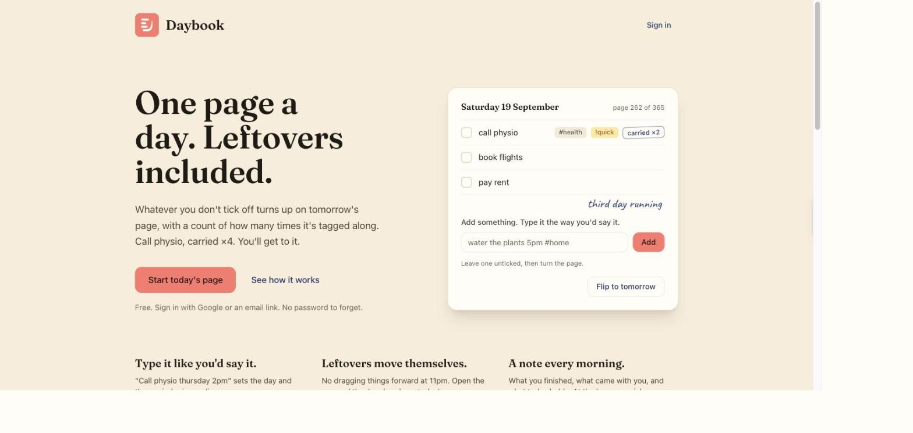
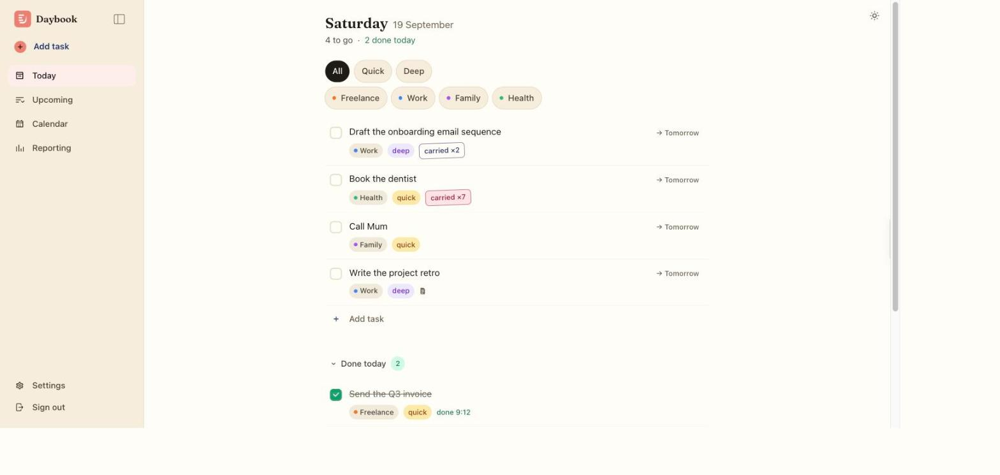
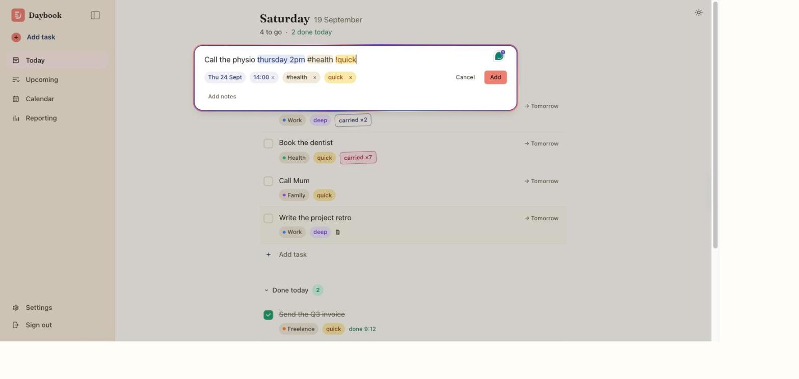
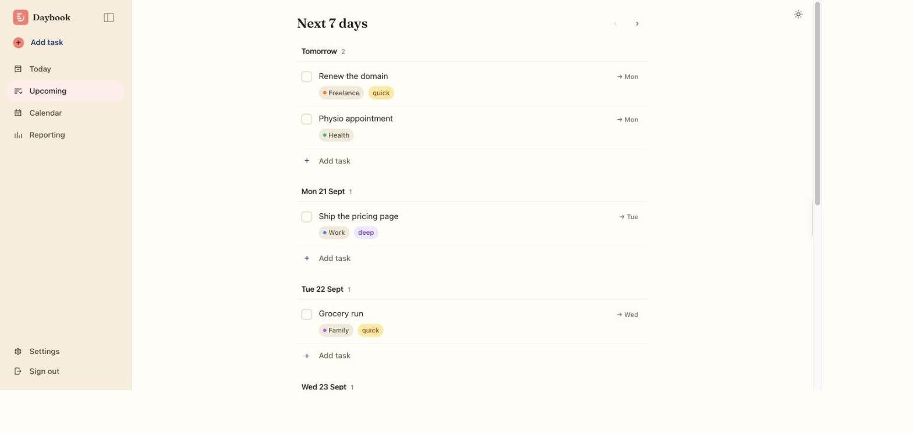
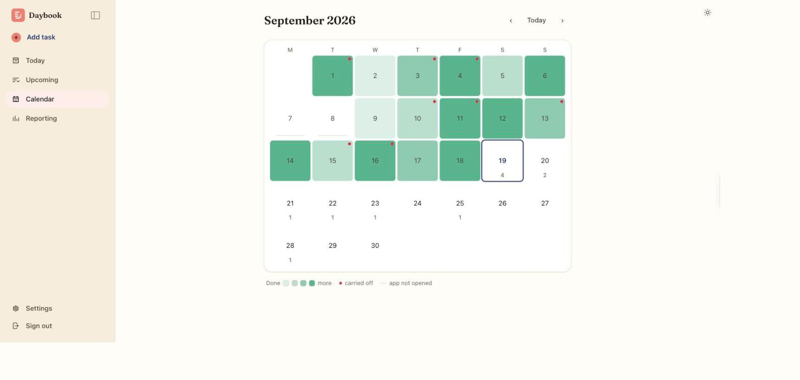
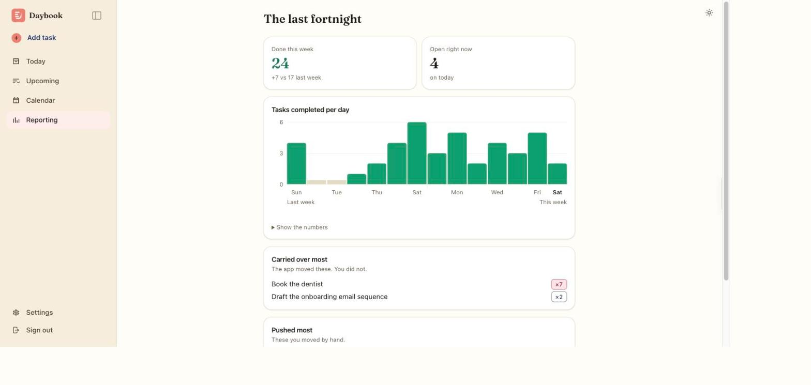
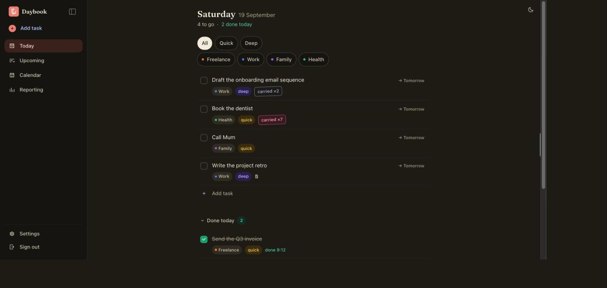
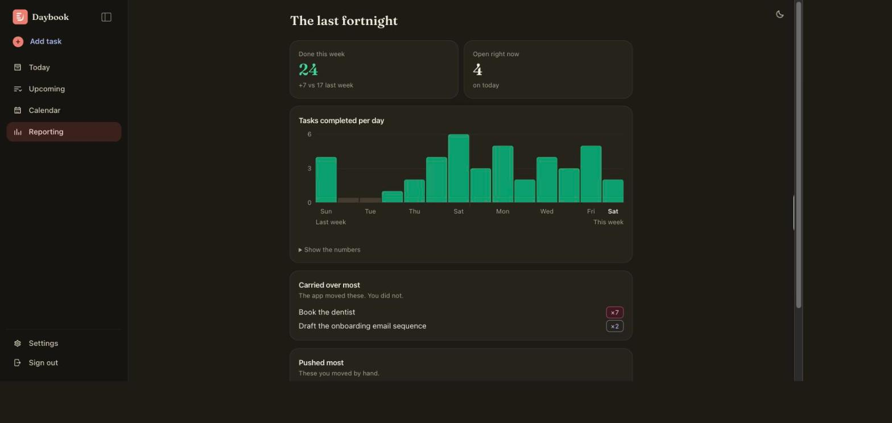

<div align="center">
  
  <h1>Daybook</h1>
  <p><strong>One page per day. Whatever you don't finish comes with you.</strong></p>
  <p>
    <a href="https://daybook.noel-sebastian.com">daybook.noel-sebastian.com</a>
  </p>
  <p>
    <sub>Angular 22 (zoneless) · NgRx SignalStore · Supabase · installable PWA</sub>
  </p>
</div>



## What it is

A daily to-do app built around one idea: **a day is a page, not a bucket.**

Open it and you get today. Tasks you finish are stamped with the time and kept,
so the page becomes a record of the day rather than an empty list. Tasks you
don't finish move to tomorrow by themselves overnight, and the app counts how
many times each one has made that trip. A task that has travelled seven days
wears `carried ×7`, in red, where you cannot miss it.

It is a personal project, used daily, and it exists because the list apps I
tried all treat an unfinished task as a row that turns red and then stays there
forever. This one makes the avoidance visible and countable instead.

## Why it's different

Most to-do apps are an infinite list with dates attached. Daybook is a book
with one page per day, and almost every design decision follows from that.

**It counts what you avoid, and it knows who moved it.**
Two separate counters, never mixed. `carried_over_count` goes up when the app
moved a task because you didn't do it. `reschedule_count` goes up when you moved
it yourself. Reporting shows them as two lists, labelled *"the app moved these,
you did not"* and *"these you moved by hand"*. They answer different questions,
and collapsing them into one "overdue" flag loses the interesting half.

**A page you can finish.**
There is no backlog view, no inbox, no someday list. If it isn't on a day, it
isn't anywhere. That constraint is the product.

**Type the whole task in one line.**
`call physio thursday 2pm #health !quick` sets the text, the day, a reminder,
a category and an energy tag. Tokens highlight as you type and resolve into
chips under the box, so you can see what was understood before committing.

**Try it before you sign up.**
The hero on the landing page is not a screenshot or a looping animation. It is
a real Daybook page running the real parser. Type into it, tick something off,
then hit *Flip to tomorrow* and watch the unticked task carry over. Nothing is
saved, and there is no account.

**Deliberately small.**
No projects, sub-projects, boards, assignees, priorities or teams. Five
semantic colours in the whole app: green means done, red means avoided, amber
is quick, violet is deep, coral is the brand. A new colour has to displace one
of those.

**No spinners.**
Every write hits the local store first and Supabase after, rolling back and
toasting if the server disagrees. Lose your connection and writes queue locally
and replay, rather than failing. Undo toasts instead of confirmation dialogs.

It borrows two things from Todoist, the floating composer and natural-language
capture, and drops nearly everything else. It is not trying to run a team of
twelve.

## What it does

### Today

Your page. Filter by energy when you only have ten minutes, or by category.
Completed tasks drop into a *Done today* section with the time they were
finished, and the list re-sorts inside a View Transition so rows visibly move
rather than jumping.



### Capture

One box, one line. The date chip is live from the moment the composer opens,
and anything the sentence doesn't say can be set by hand from the chips.
Notes hide behind *Add notes* so the box keeps its height.



### Upcoming

The next seven days as a list, with a per-day *Add task* row that schedules by
position. Pages forward three weeks.



### Calendar

Bidirectional, with today as the boundary. Past cells show completion density
as a heat map, future cells show how much is scheduled. A day the app was never
opened is drawn differently from a day where nothing got done, because those
are not the same thing.



### Reporting

The weekly review: how much you finished, what keeps carrying, what you keep
pushing. One chart, one series, a fixed and labelled scale so a good week
doesn't redraw at the same height as a great one.



### Light, dark and system

Dark mode is a semantic token layer over an unchanged palette, not a repaint.
The choice is applied by a synchronous script before first paint, so a dark
install never flashes white on a cold load.




### And the rest

- **Daily email digest.** What you finished, what's still open, a preview of
  tomorrow. Sent in your own timezone by a scheduled Edge Function.
- **Reminders.** Web Push to an installed PWA, from a time you can set in the
  task line.
- **Installable.** Add to home screen on iOS or Android and it runs standalone.
- **Offline.** Writes made with no connection queue locally and replay.
- **Swipe.** Right to complete, left to reschedule.

## Capture syntax

| Token | Effect | Example |
|---|---|---|
| plain text | the task | `call the physio` |
| natural date | schedules it | `thursday`, `next monday`, `in 3 days` |
| date + time | schedules it and sets a reminder | `thursday 2pm` |
| `#tag` | category, created if new | `#physio` |
| `!quick` / `!deep` | energy tag | `!quick` |

`call physio thursday 2pm #physio !quick` becomes a task called "call physio",
scheduled Thursday, reminder at 2pm, category physio, quick.

No date means today. Enter adds, Shift+Enter is a newline. Notes are never
parsed, so a `#tag` typed into a note stays literal text.

Tags and energy are extracted before the date parser runs, so it cannot claim a
substring inside one. Otherwise it reads "may" out of `#maybe`.

## How carry-forward works

On app open the client sends its **local** date to the `rollover_and_snapshot`
function. The function clamps that date to within a day of server time, writes a
`day_snapshots` row for every day since the last one, then moves every
incomplete past-dated task to today and adds the number of days it slipped to
`carried_over_count`.

Two consequences worth knowing:

- **The count goes up by days, not by opens.** Skip a weekend and a task
  carried from Friday lands on Monday with `carried ×3`, not `carried ×1`.
- **It is idempotent.** Running it twice on the same day does nothing, so the
  double call that any race can produce is free.

## How it's built

| Layer | Choice |
|---|---|
| Framework | Angular 22, standalone components, **zoneless** |
| State | Signals locally, NgRx SignalStore for shared state |
| Styling | Tailwind v4 via `.postcssrc.json`, theme tokens in `src/styles.css` |
| Backend | Supabase: Postgres 17, Auth, Edge Functions, pg_cron |
| Auth | Google OAuth, with an email magic link kept as a recovery path |
| Date parsing | `chrono-node` |
| Delivery | Installable PWA via `@angular/pwa`. No native codebase |
| Hosting | Vercel, DNS on Cloudflare |
| Email | Resend |

A few decisions that shaped the code more than the table suggests:

- **Zoneless.** No `zone.js` anywhere. Anything that mutates state outside
  Angular goes through a signal, and every component is `OnPush`.
- **Components never touch Supabase.** They read from stores and call store
  methods. Four stores and three services own everything else.
- **Optimistic by rule, not by case.** Patch the store, call the server, roll
  back and toast on failure. A dropped connection is not a failure: it queues.
- **The Supabase client is composed by hand** from `auth-js` and `postgrest-js`
  rather than built with `createClient()`, which eagerly instantiates Realtime
  and Storage. The app subscribes to no channels and uploads no files, so that
  was 121 kB of JavaScript in the initial chunk for code that never ran. See
  the comment at the top of `src/app/core/supabase.ts`, which documents the
  four things upstream does that had to be reproduced exactly.
- **One webfont.** Fraunces, self-hosted, Latin-subset, 39.9 kB, used for
  display text only. UI text is on the system stack.
- **Dates are never `toISOString()`.** A day is a local `YYYY-MM-DD` string.
  Converting to UTC first puts anything before 10am in Sydney on the previous
  day, which silently corrupts rollover.
- **RLS on every table**, owner-only via `auth.uid() = user_id`. The publishable
  key is safe in the bundle because of it.

Current numbers, from a clean build and test run:

```
initial bundle   439.63 kB raw, 107.90 kB transfer
tests            736 passing across 38 files
```

## Run it locally

```bash
npm install
npm start
```

Then open http://localhost:4200 and sign in with Google or the email link.

```bash
npm start          # dev server
npm run build      # production build
npm test           # unit tests (vitest, jsdom, no browser)
```

The Supabase URL and publishable key live in `src/environments/environment.ts`
and are committed deliberately. Migrations in `supabase/migrations/` are already
applied to the live project; they are here so the schema is reproducible, not
because anything is pending.

Deployment, auth redirect URLs, DNS and the icon pipeline are in
[`docs/OPERATIONS.md`](docs/OPERATIONS.md).

## Where things are

```
src/
  app/
    core/          stores, Supabase client, guards, dates, capture parsing,
                   nav and theme services
    features/
      welcome/     marketing page, the only file exempt from the type scale
      login/       Google + magic link
      today/       Today view, capture box, task row, composer, task detail
      upcoming/    the next seven days
      calendar/    month grid and the day drill-in
      reporting/   charts
      settings/    timezone, digest, reminders
    shared/        shell, brand/logo, toasts, popover, date picker, swipe,
                   empty states, install hint, theme toggle
  testing/         spec harness: zoneless providers, a fake Supabase, row
                   builders. Excluded from the production compile
  styles.css       the theme: palette, semantic tokens, both colour schemes
supabase/
  migrations/      numbered SQL, never edited once applied
  functions/       notify: the digest and reminder sender
docs/
  SESSIONS.md      chronological log, written by the session-handoff skill
  OPERATIONS.md    deploying, auth URLs, DNS, icons
  screenshots/     the images in this file
tools/
  build-icons.mjs  rasterises public/icon.svg into the PNGs and favicon.ico
```

A component is a set of siblings sharing one basename: `task-row.ts` for the
class, `task-row.html` for the template, `task-row.spec.ts` for the tests, plus
`.constants.ts` / `.data.ts` / `.helpers.ts` where those exist. Templates are
never inline, and that is a rule rather than a preference. `AGENTS.md` explains
what it cost to learn.

## Documentation

**[`BUILD-PLAN.md`](BUILD-PLAN.md) is the single source of truth**: what the app
is, the full feature list with current state, the data model, rollover logic,
every locked decision and everything still to do.

[`AGENTS.md`](AGENTS.md) holds the repo conventions.
[`docs/SESSIONS.md`](docs/SESSIONS.md) is the chronological log, recording
intent, dead ends and open threads rather than changes, since git already covers
those.

## Licence

Copyright © 2026 Noel Sebastian.

Daybook is free software under the **GNU Affero General Public License v3.0**.
You may use, study, modify and share it, and if you run a modified version as a
network service you must offer that version's source to its users. The full
terms are in [`LICENSE`](LICENSE).

If those terms don't suit your use, I'm happy to discuss a commercial licence.

The bundled Fraunces subset in `public/fonts/` is not mine and is not covered by
the above. It stays under the SIL Open Font License, included alongside it as
`public/fonts/OFL.txt`.

## Status

Every planned feature is built and in production, and the app is in daily use.
What's outstanding is mostly verification rather than functionality: the offline
queue has never been exercised by a person, a two-account pass on one device is
the remaining gate on multi-tenancy, and two hardening items are still open in
the Supabase dashboard. `BUILD-PLAN.md` §4 and §12 keep the honest list.
